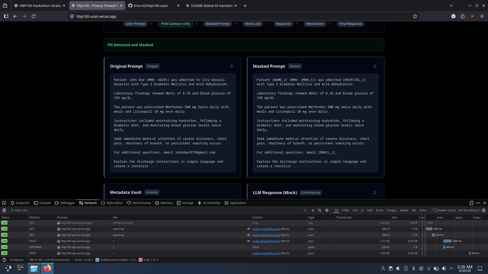
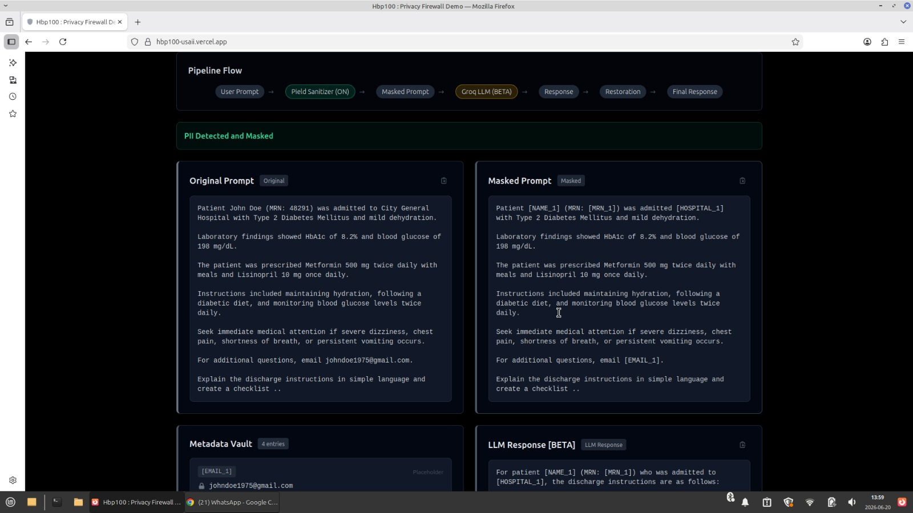
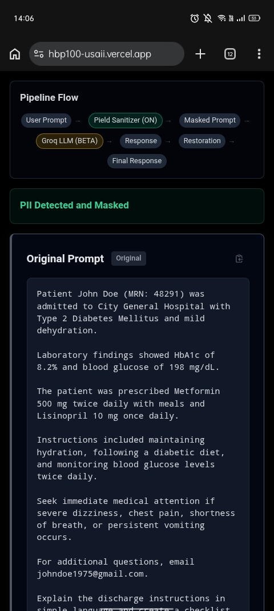

# HBP100

> **Understand complex medical and insurance documents using AI without exposing your sensitive information.**

Move from:

```text
Confusion
        ↓
Understanding
        ↓
Action
```

HBP100 is a lightweight, privacy-preserving AI workflow that enables users to safely obtain AI-powered explanations for sensitive documents without unnecessarily exposing personally identifiable information (PII).

Unlike traditional AI assistants that receive complete documents, HBP100 removes sensitive information before external AI processing and restores it afterward, allowing users to benefit from modern language models while keeping their personal information protected.

---

# 🌐 Live Demo

### Frontend

https://hbp100-v2.vercel.app

### Core Privacy Engine

https://github.com/Erox-02/humming-bird-v2

### Live Demo Repository

https://github.com/Erox-02/hbp100-v2-live

---

# Problem

Medical reports, discharge summaries, insurance approvals, reimbursement letters, and many other official documents are often difficult for non-experts to understand.

As a result, millions of people increasingly rely on AI assistants for explanations.

However, these documents frequently contain sensitive information such as:

- Full names
- Email addresses
- Phone numbers
- Medical Record Numbers (MRNs)
- Hospital names
- Addresses
- Dates
- Other personally identifiable information

Uploading these documents directly means private information may unnecessarily leave the user's device.

There should be a safer approach.

---

# Solution

HBP100 acts as a **privacy firewall** between the user and the language model.

Before a document reaches an external AI model:

- Sensitive entities are detected locally.
- Each entity is replaced with a reversible placeholder.
- Only the sanitized prompt is transmitted.

After AI generation:

- Original values are automatically restored.
- Users receive a natural response containing their own information.
- External AI models never receive sensitive information in plain text.

The result is simple:

**Users receive the benefits of AI while significantly reducing unnecessary privacy exposure.**

---

# Why HBP100?

Traditional AI assistants expect users to upload complete documents.

HBP100 follows a different philosophy.

> **Sensitive information should never reach external AI systems unnecessarily.**

The project is also built around another engineering principle:

> **Do not use heavyweight AI when lightweight methods are sufficient.**

Many tasks inside an AI workflow do not require another neural network.

Entity extraction, masking, validation, placeholder generation, and restoration can often be solved more efficiently using deterministic algorithms and lightweight machine learning.

Instead of placing a large language model throughout the entire pipeline, HBP100 uses a modular architecture where every component performs the task it is best suited for.

This approach prioritizes:

- Low latency
- Explainability
- Modularity
- Efficiency
- Responsible AI usage

The objective is not to maximize model size, but to use the right tool for every stage of the workflow.

---

# Workflow

```text
                 User Uploads Document
                           │
                           ▼
                   FastAPI Backend
                           │
                           ▼
                        HBP100
                           │
                           ▼
                  Entity Extractors
                           │
                           ▼
                   TF-IDF Vectorizer
                           │
                           ▼
                LightGBM Policy Engine
                           │
                           ▼
                Placeholder Generator
                           │
                           ▼
                     Metadata Vault
                           │
                           ▼
                    Sanitized Prompt
                           │
                           ▼
                 Groq Llama-3.3-70B
                           │
                           ▼
               Placeholder Restoration
                           │
                           ▼
                 Plain Language Response
```

---

# Features

- 🔒 Privacy-preserving AI explanations
- 📄 Plain-language summaries for complex documents
- ✅ Automatic checklist generation
- 🔄 Reversible placeholder masking
- 📦 Metadata Vault
- ⚡ TF-IDF + LightGBM contextual privacy engine
- 🧩 Modular architecture
- 📱 Mobile-friendly interface
- 🚀 FastAPI backend with Vercel deployment
- 🛡️ Responsible AI guardrails

---

# Intended Users

HBP100 is designed for people who need help understanding important documents without unnecessarily exposing sensitive information.

Example users include:

- Patients reviewing discharge summaries.
- Caregivers helping family members understand hospital documents.
- Individuals reviewing insurance approvals or reimbursement letters.
- Anyone seeking AI assistance while preserving personal privacy.

The system helps users move from:

```text
Complex Document
        ↓
Protected AI Processing
        ↓
Simple Explanation
        ↓
Actionable Checklist
```

Medical, legal, and financial decisions remain the responsibility of qualified professionals.

---

# Example

## Original Input

```text
Patient John Doe (MRN: 48291) was admitted to City General Hospital with Type 2 Diabetes Mellitus and mild dehydration.

Laboratory findings showed HbA1c of 8.2% and blood glucose of 198 mg/dL.

The patient was prescribed Metformin 500 mg twice daily with meals and Lisinopril 10 mg once daily.

Instructions included maintaining hydration, following a diabetic diet, and monitoring blood glucose levels twice daily.

Seek immediate medical attention if severe dizziness, chest pain, shortness of breath, or persistent vomiting occurs.

For additional questions, email johndoe1975@gmail.com.

Explain the discharge instructions in simple language and create a checklist.
```

---

## Privacy-Preserved Prompt

```text
Patient [NAME_1] (MRN: [MRN_1]) was admitted to [HOSPITAL_1] with Type 2 Diabetes Mellitus and mild dehydration.

Laboratory findings showed HbA1c of 8.2% and blood glucose of 198 mg/dL.

The patient was prescribed Metformin 500 mg twice daily with meals and Lisinopril 10 mg once daily.

Instructions included maintaining hydration, following a diabetic diet, and monitoring blood glucose levels twice daily.

Seek immediate medical attention if severe dizziness, chest pain, shortness of breath, or persistent vomiting occurs.

For additional questions, email [EMAIL_1].

Explain the discharge instructions in simple language and create a checklist.
```

---

## AI Response

The language model receives only the sanitized version of the document.

It can safely:

- Explain discharge instructions in plain language.
- Generate an actionable checklist.
- Highlight warning symptoms.
- Preserve placeholders throughout the response.

---

## Restored Output

Once AI generation is complete, HBP100 restores every placeholder using the Metadata Vault.

The user receives a natural explanation containing the original values, while the external AI model never had access to those sensitive values in plain text.

---

# Screenshots

## Performance Benchmark



## Arch Linux


## Windows


## Linux Mint



## Android



---

# Architecture

HBP100 follows a modular privacy-first architecture.

Each component performs a single responsibility, making the system easier to understand, debug, and extend.

```text
                     Frontend (React)
                             │
                             ▼
                     FastAPI Backend
                             │
                             ▼
                          HBP100
                             │
         ┌───────────────────┴───────────────────┐
         ▼                                       ▼
 Entity Extractors                     TF-IDF Vectorizer
         │                                       │
         └───────────────► LightGBM ◄────────────┘
                             │
                             ▼
                  Placeholder Generator
                             │
                             ▼
                      Metadata Vault
                             │
                             ▼
                   Sanitized Prompt
                             │
                             ▼
                    Groq Llama-3.3-70B
                             │
                             ▼
                 Placeholder Restoration
                             │
                             ▼
                     Final AI Response
```

---

# Technology Stack

## Frontend

- React
- Vite
- Tailwind CSS

## Backend

- FastAPI
- Uvicorn

## AI Components

- Groq API
- Llama-3.3-70B

## Privacy Engine

- HBP100 v2.2
- Regex Entity Extractors
- TF-IDF Vectorizer
- LightGBM Classifier
- Metadata Vault
- Placeholder Generator
- Placeholder Validator
- Placeholder Restoration

---

# Performance

The project prioritizes lightweight execution over heavyweight privacy models.

## Privacy Pipeline

Average masking latency:

**≈380 ms**

(Model preloaded)

## End-to-End Pipeline

Privacy masking → LLM inference → Restoration

Average response time:

**≈2.3 seconds**

### Benchmark


---

# Platform Compatibility

HBP100 is browser-based and requires no platform-specific installation.

Tested on:

- ✅ Arch Linux (KDE Plasma)
- ✅ Windows
- ✅ Linux Mint
- ✅ Android

---

# Responsible AI

HBP100 is designed as an **explanation tool**, not an autonomous decision-making system.

The project helps users understand information already present in a document.

It **does not**:

- Diagnose diseases
- Prescribe medication
- Modify dosages
- Make legal decisions
- Make financial decisions

Users should always consult qualified professionals before making important decisions.

---

# Human-in-the-Loop

Human oversight remains central to the workflow.

HBP100 assists users by simplifying complex documents, but final medical, legal, and financial decisions remain the responsibility of qualified professionals.

The system augments human understanding—it does not replace professional expertise.

---

# Limitations

Current limitations include:

- OCR support is not yet implemented.
- Some entities may not always be detected.
- Placeholder numbering follows extraction order rather than textual order.
- Entity recognition depends on extractor coverage.
- Some edge cases may produce imperfect replacements.

## Why?

HBP100 v2.2 intentionally uses a lightweight hybrid architecture combining:

- Regex-based entity extractors
- TF-IDF vectorizer
- LightGBM classifier

rather than large Named Entity Recognition (NER) models.

This design favors:

- Low latency
- Explainability
- Small deployment size
- Modularity
- Ease of maintenance

Future releases will improve contextual extraction while preserving these design goals.

---

# Future Roadmap

## HBP100 v3

Planned improvements include:

- OCR integration
- Image document understanding
- Multi-language support
- Context-aware entity extraction
- Streaming responses
- Improved placeholder alignment
- Better overlapping entity detection
- Optional retrieval from trusted public knowledge sources

The long-term vision remains unchanged:

> **Protect privacy before intelligence.**

---

# Design Goals

HBP100 is built around five core principles.

- 🔒 Privacy by default
- ⚡ Lightweight execution
- 🧩 Modular architecture
- 🔍 Explainability
- 🤝 Responsible AI

Every architectural decision is evaluated against these principles.

---

# Built With

## Frontend

- React
- Vite
- Tailwind CSS

## Backend

- FastAPI
- Uvicorn

## AI

- Groq API
- Llama-3.3-70B

## Privacy Engine

- HBP100 v2.2
- Regex Extractors
- TF-IDF
- LightGBM
- Metadata Vault

---

# License

MIT License

---

# Author

**Dipanjan Dutta**

---

# Citation

If you use HBP100 in academic work or research, please cite the project repository.

```text
Dipanjan Dutta.
HBP100: A Lightweight Privacy Firewall for LLM Workflows.
GitHub.
https://github.com/Erox-02/humming-bird-v2
```

---

# Final Thought

> **Sensitive information should never reach external AI systems unnecessarily.**

HBP100 demonstrates that privacy and AI do not have to compete.

By combining lightweight machine learning, deterministic privacy techniques, and modern language models, it is possible to build AI workflows that are fast, explainable, and privacy-conscious from the ground up.
